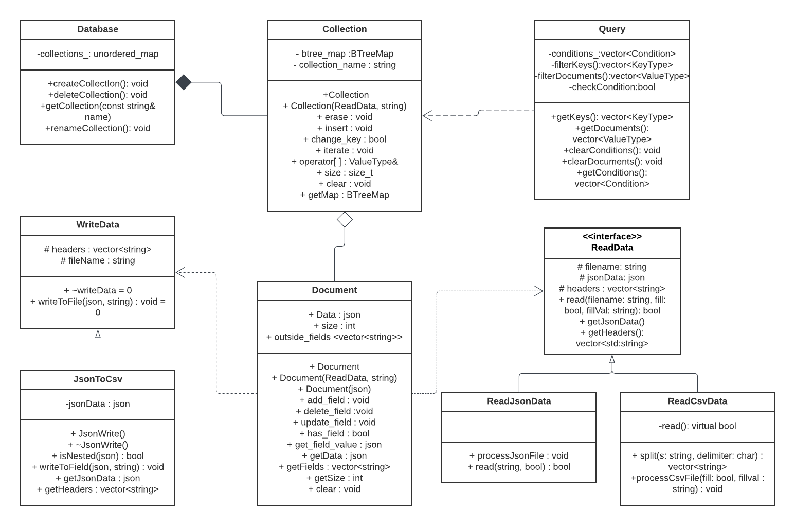
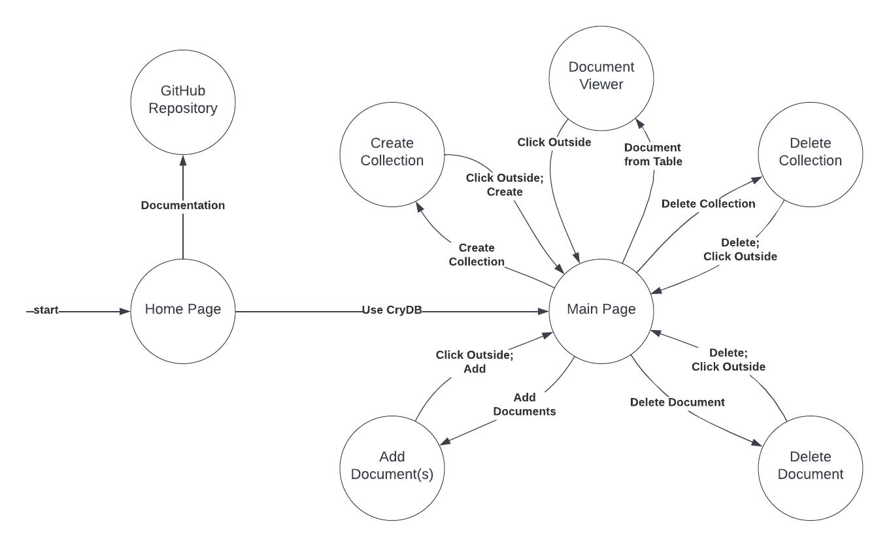
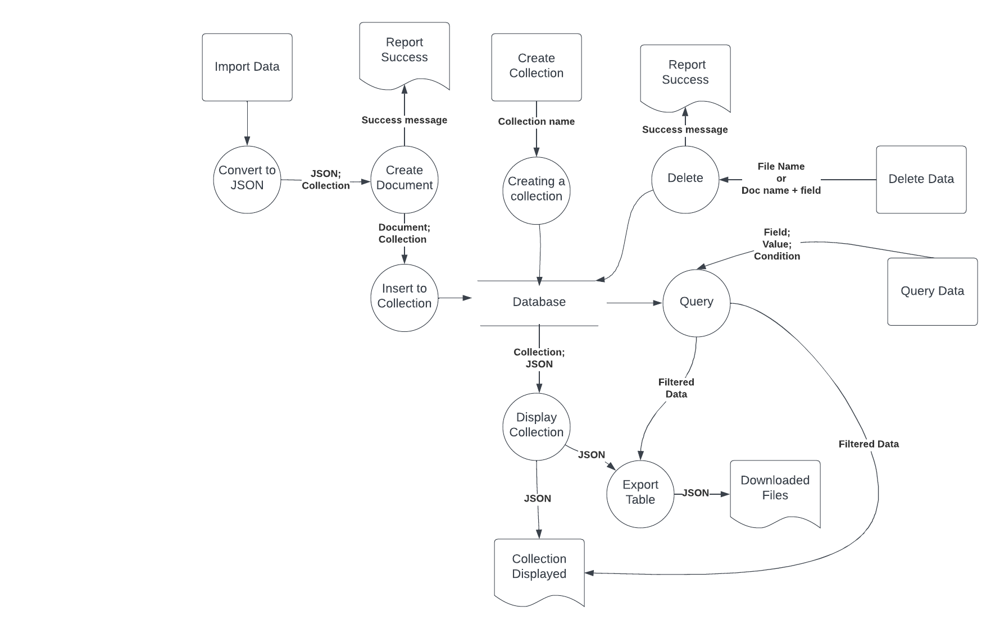

[](https://classroom.github.com/online_ide?assignment_repo_id=10810701&assignment_repo_type=AssignmentRepo)

# CryDB

Contributors: Daniel Castaneda, Ethan Ortega, Zinal Patel, Bowen Tang, Eddie Vargas

# Project Description

CryDB is a simple, easy to use database designed for software developers to manage JSON, CSV, and XLSX data. Users can import and export documents of using json, csv, and excel type data, query for existing documentation, and organize the database using our intuitive web based interface. Our search algorithm features an indexing system that allows for efficient search and query calls.

# Features

* CRUD Operations (Create, Read, Update, and Delete)
* Query (Retrieve specified data in organized and efficient manner)
* Sort (Sort data presented in table format to view specified orders)
* Exporting (Export filtered and sorted tables into JSON)

# Usage Instructions

* This database features an online GUI to optimally visualize files and relationships
* Once the database code has been cloned and ran, everything stored will be local which improves security and speeds as there is no throttling waiting for other users

STEPS:
* &nbsp;&nbsp; 1. Clone GIT repository
* &nbsp;&nbsp; 2. Navigate into the back-end portion of the database
* &nbsp;&nbsp; 3. Run back-end server with:
```shell
make && sudo .\build\boostServer 0.0.0.0 80
```
* &nbsp;&nbsp; 4. Navigate into the front-end server by:
```shell
cd .\crydb
```
* &nbsp;&nbsp; 5. Start front-end server with:
```shell
npm run dev
```
* &nbsp;&nbsp; 6. Open prompted host with browser and use the database!

# Timeline

Sprint 1-2:

* &nbsp;&nbsp;&nbsp;&nbsp; Project Proposal & Ideas
* &nbsp;&nbsp;&nbsp;&nbsp; UML diagram formation & design choices

Sprint 3-4:
* &nbsp;&nbsp;&nbsp;&nbsp; Low level functions with Unit Testing
* &nbsp;&nbsp;&nbsp;&nbsp; Initial UI Implementation

Sprint 5-6:
* &nbsp;&nbsp;&nbsp;&nbsp; Database handler implementation
* &nbsp;&nbsp;&nbsp;&nbsp; Sorting & Querying functions formed
* &nbsp;&nbsp;&nbsp;&nbsp; UI improvements and feature additions

Sprint 7-8:
* &nbsp;&nbsp;&nbsp;&nbsp; Front-end and Back-end connection creation
* &nbsp;&nbsp;&nbsp;&nbsp; Finalize UI design
* &nbsp;&nbsp;&nbsp;&nbsp; System testing and refactoring

## Behind the Scenes

### Back-End

#### C++ / JSON / BOOST / BEAST

* &nbsp;&nbsp;&nbsp;&nbsp; Back end framework done in C++, handling JSON objects & with aid of Boost & Beast C++ libraries

#### CMake / Make / Google Testing

* &nbsp;&nbsp;&nbsp;&nbsp; Generate build files, run them, and unit test with Google testing

## Front-End

* &nbsp;&nbsp; React/Next.js: Javascript libraries for building interfaces and connections

# UML Diagram

[](https://github.com/CS180-spring/cs180-21-CryPlusPlus/tree/main/repoImages/UML.png)

# Interface FSM

[](https://github.com/CS180-spring/cs180-21-CryPlusPlus/tree/main/repoImages/FSM.png)

# DFD (Data Flow Diagram)

[](https://github.com/CS180-spring/cs180-21-CryPlusPlus/tree/main/repoImages/DFD.png)

# Burn Down Chart

[](https://github.com/CS180-spring/cs180-21-CryPlusPlus/tree/main/repoImages/Burndown.png)
